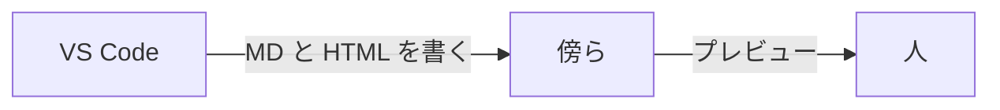

# 画面仕様

生成AIが HTML を出すときの契約。

## 共通

- 左にナビ、右が本文
- モバイルではナビが上に積まれる想定（このサンプルはデスクトップ優先）

## 画面

1. この画面の見方 … ビューアの使い方を、生成物として置く
2. 今日のレビュー … チケット3件。状態はタグ
3. TICKET-104 … 完了条件と、人とAIの分担

## コピー

ボタンは短く。「生成した画面を見る」「TICKET-104 を開く」だけ。

## 画面の関係

